An instance of watsonx Assistant has been provisioned for the purposes of this lab.  Follow these steps to create an Assistant:

1. Login to the [IBM Cloud](https://cloud.ibm.com) and provide the user credentials for your student ID.
2. Ensure that you are using the correct account.  If not, select the itzenablement64 account from the Account list in the upper right.
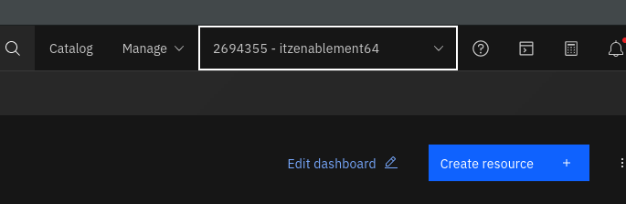{width=800}
3. You should see the watsonx Assistant Service in the Resource List.  Click on the name and then Press "Launch Assistant"
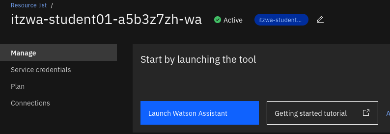{width=800}
4. You will need to create a new assistant to get started.  Provide a name and description, then answer the questions on the proceeding pages.  
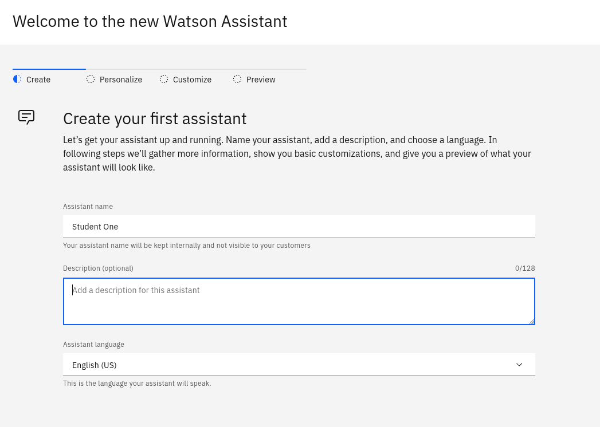{width=800}

From here, we can now add our extension and an action to call out to it.

## Adding a Custom Extension
Adding the extension is done on the Integrations page of the Assistant.  In the lower left corner, select Integrations, then scroll down to the "Build custom extension button". 

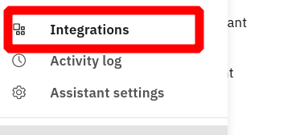{width=300}
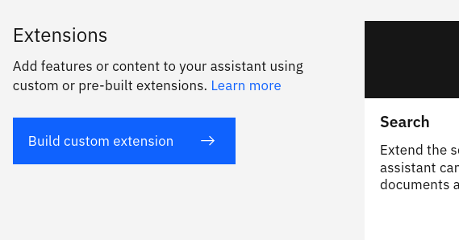{width=500}

From here, step through the process of adding the openapi.json file that was created earlier in this lab.  Once completed, there will be a tile on the Integrations page that will have your custom extension.  Now, you can add the server address and other information necessary by clicking on the **Add +** button.

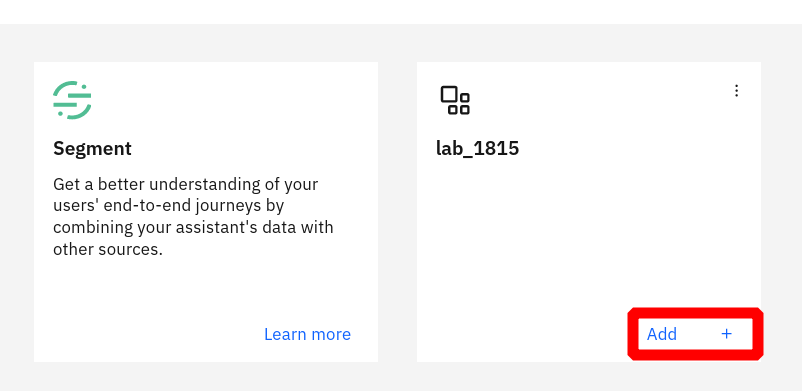{width=500}

After pressing next and moving to the Authentication page, the specifics for the API can be added.  For the purposes of this lab, no API key or authentication is necessary.  The server URL will still need to be added though.  Add this at the bottom of the screen in the **Server variables** section.

??? note 
    If you are using your own API, then you may have to add the credentials in this section.  Please verify with the API provider for the necessary format.

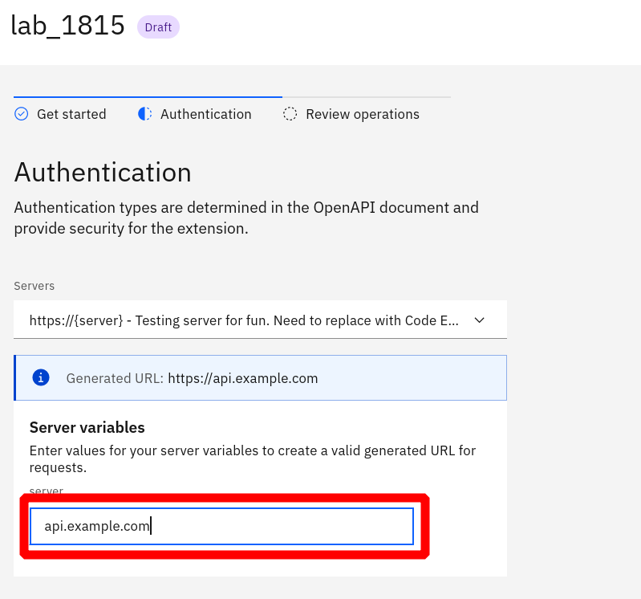{width=800}

## Create an action that calls the extension
In the example specification, the API provides information about a user or creates a user with the supplied information.  To create an Action in Assistant, you will need to gather the information necessary to call the API.  

To begin, create a new Action from scratch.  Give a few examples of how a customer would start this conversation.

Now, you can add a step to ask for the user's name.  To do this, have the Assistant ask the question, then in **Define User Response**, choose Free Text as the type of input.  The next step will ask for this user's email address.  In the user response, there is a predefined regex type that will look for email patterns.

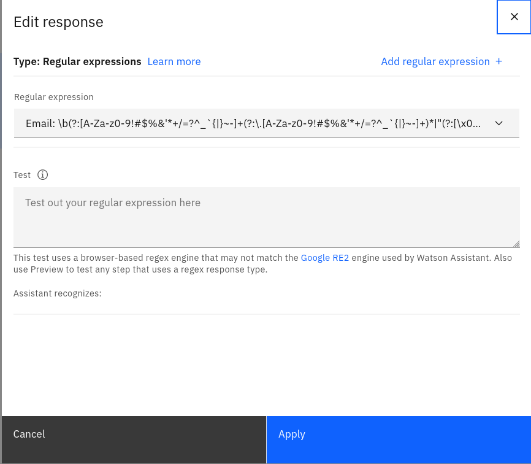{width=800}

With a new step, we will call the custom extension.  In the bottom section "And then...", choose the **Use an extension** option to open a new window and call your extension.  Choose the custom extension added for this lab, then in the name field, select **Action Step Variable** and select the response for step one.  Then do the same for the email.

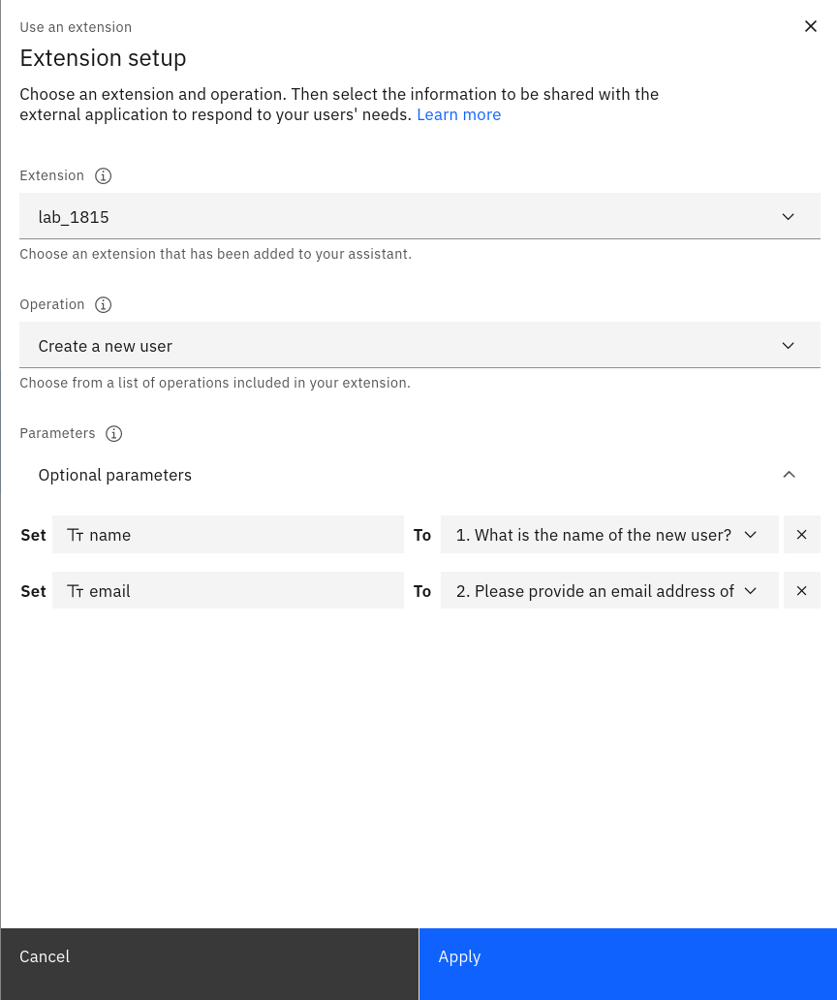{width=800}

Now that the extension is called, we can check to see if it ran successfully and respond to the user.  If the extension returns information, then this data will be stored in a variable that can be presented to the end user. You can also end the Action as no further steps will be needed.

## Test the extension
To test the Assistant and calling the extension, use the Preview button in the bottom right of the Actions section.  This tool provides many features that help test and troubleshoot both the Action and the extension.

If there is an error when calling the extension, you can use the **Inspect** tool to see what was sent and received from the extension.  There are other options for checking the values of session and action variables.

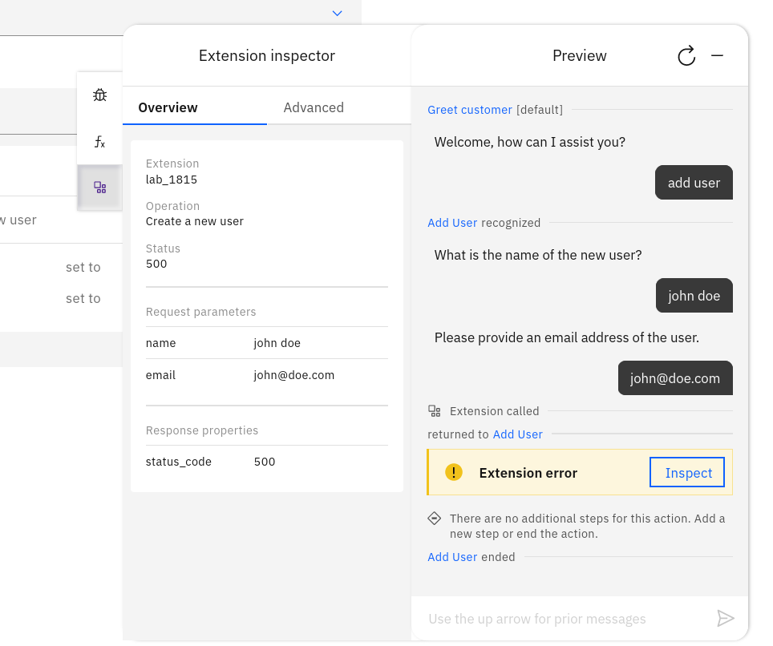{width=800}

Whenever an extension is called, there is a **Ran Successfully** variable that is created to ensure that the extension completed without errors.  This variable can be used as a condition for further steps to ensure using the data returned is available.

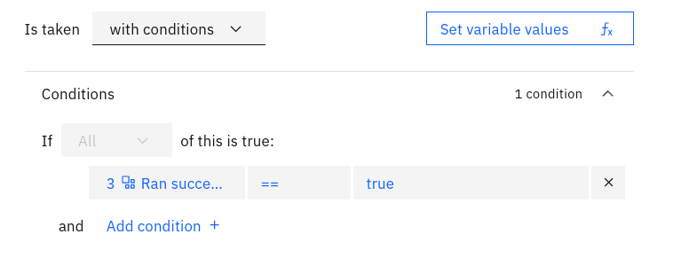{width=800}

Once you have called the extension successfully and showed data within the Assistant chat session, you have completed this lab!
